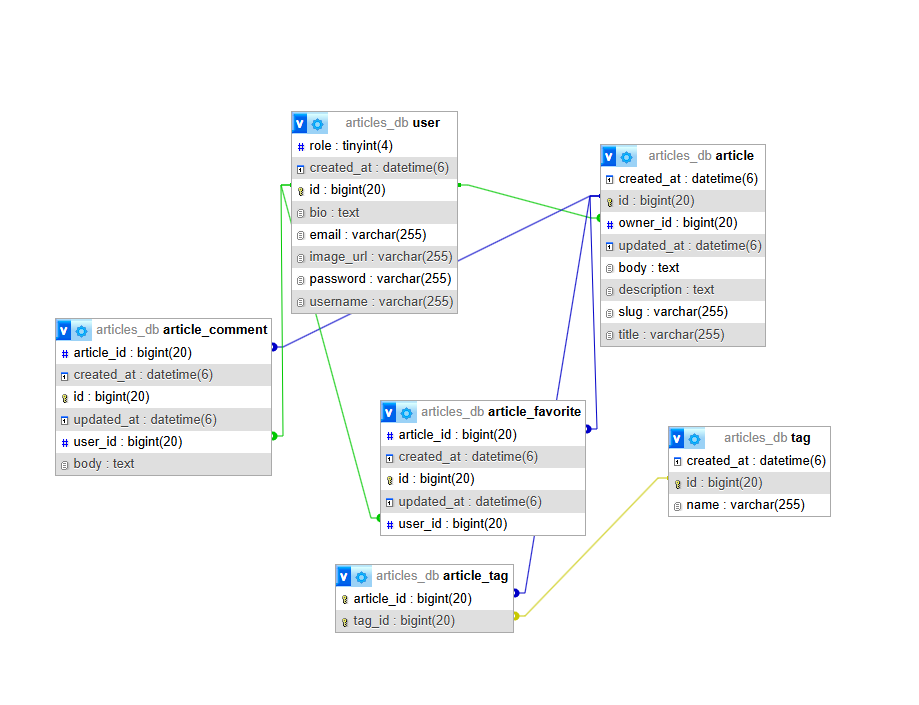

# ArticlesApplication

## О проекте
**ArticlesApplication** — это современное веб-приложение на базе Spring Boot, созданное для управления статьями, тегами и комментариями. Приложение позволяет пользователям регистрироваться, публиковать новые статьи, редактировать и удалять их, а также оставлять комментарии. Система поддерживает несколько уровней доступа: гости могут просматривать статьи, зарегистрированные пользователи – работать со своими материалами, а администраторы имеют полный контроль над контентом и пользователями.

## Структура проекта

### config/
- **InsertData**  
  Генерирует тестовые данные и наполняет ими базу данных. Дополнительно происходит хэширование паролей для безопасности.
- **SecurityConfig**  
  Настраивает процессы аутентификации и авторизации, ограничивая доступ к определённым разделам сайта для неавторизованных пользователей и определяя алгоритм шифрования паролей.

### controllers/
- **ArticleController**  
  Отвечает за маршрутизацию и взаимодействие между сервисом статей и пользователями.
- **LoginController**  
  Отвечает за отображение страницы входа (login.html).
- **RegistrationController**  
  Обрабатывает регистрацию новых пользователей, сохраняет их данные и перенаправляет на страницу входа.
- **TagController**  
  Предоставляет интерфейс для создания, редактирования и удаления тегов.
- **UserController**  
  Управляет информацией о пользователях, предоставляет функционал для их создания, редактирования и удаления.

### entities/
- **Article**  
  Определяет модель статьи и её связь с другими сущностями.
- **ArticleComment**  
  Модель для комментариев, оставляемых к статьям.
- **ArticleFavorite**  
  Сущность, описывающая избранные статьи.
- **Author**  
  Представляет данные автора (или владельца) статьи.
- **Tag**  
  Модель, описывающая тег, используемый для классификации статей.
- **User**  
  Основная сущность для пользователей, содержащая данные для аутентификации и ролей.

### repositories/
- **ArticleCommentRepository**  
  Интерфейс доступа к комментариям.
- **ArticleFavoriteRepository**  
  Интерфейс для управления избранными статьями.
- **ArticleRepository**  
  Интерфейс работы со статьями.
- **AuthorRepository**  
  Репозиторий для работы с авторами.
- **TagRepository**  
  Интерфейс для операций с тегами.
- **UserRepository**  
  Репозиторий для управления данными пользователей.

### service/
- **ArticleService** и **ArticleServiceImpl**  
  Определяют и реализуют бизнес-логику работы со статьями.
- **AuthorService** и **AuthorServiceImpl**  
  Осуществляют операции, связанные с авторами.
- **CustomUserDetailsService**  
  Реализует механизм проверки наличия пользователя и конвертации его ролей в полномочия Spring Security.
- **TagService** и **TagServiceImpl**  
  Обеспечивают операции по управлению тегами.
- **UserService** и **UserServiceImpl**  
  Реализуют функциональность для управления пользователями.

### Главный класс
- **ArticlesApplication**  
  Точка входа в приложение, запускает Spring Boot-приложение.

## Запуск проекта


1. Скачать и включить XAMPP  (https://www.apachefriends.org/ru/index.html), после этого  зайти на вкладку SQL и дальше идти по пунктам.

1.1. **Создание базы данных:**
   ```sql
   CREATE DATABASE IF NOT EXISTS articles_db
     CHARACTER SET utf8mb4
     COLLATE utf8mb4_unicode_ci;

   CREATE USER 'new_user'@'localhost' IDENTIFIED BY 'new_password';
   GRANT ALL PRIVILEGES ON articles_db.* TO 'new_user'@'localhost';
   FLUSH PRIVILEGES;
   ```
2. **Скачать код с GitHub:**
https://github.com/Vitali-Kol/articles/tree/final321
3. **Разархивация папки**
Разархивируйте файл и запустить файл в любой среде которой вам удобно. 
   Приложение будет доступно по адресу [http://localhost:8080](http://localhost:8080).  


## Функциональность

- **Контент:**  
  Возможность создания, редактирования, удаления и поиска статей.
  
- **Пользователи:**  
  - **Неавторизованные** – могут просматривать статьи.
  - **Зарегистрированные пользователи** – могут создавать, редактировать и удалять собственные статьи, комментировать и работать с тегами.
  - **Администраторы** – обладают полными правами: управление всеми статьями, тегами и пользователями, включая удаление любых записей.

- **Теги:**  
  Создание, редактирование и удаление тегов, привязка их к статьям.

- **Комментарии:**  
  Возможность оставлять комментарии к статьям.

## База данных (ER-диаграмма)
  
*Пример диаграммы:*
- **user** – хранит данные о пользователях (id, username, email, password, bio, role).
- **article** – хранит информацию о статьях (id, title, description, body, owner_id, created_at, updated_at).
- **tag** – описывает теги (id, name, createdAt).
- **article_tag** – связывает статьи и теги, реализуя отношение «многие ко многим».
- **article_comment** – комментарии к статьям.

## Роли пользователей
- **USER** – стандартный пользователь, который может создавать, редактировать и удалять только собственные записи, а также оставлять комментарии.
- **ADMIN** – администратор с расширенными правами, способный управлять всеми записями, включая редактирование и удаление чужих статей, управление тегами и пользователями.


